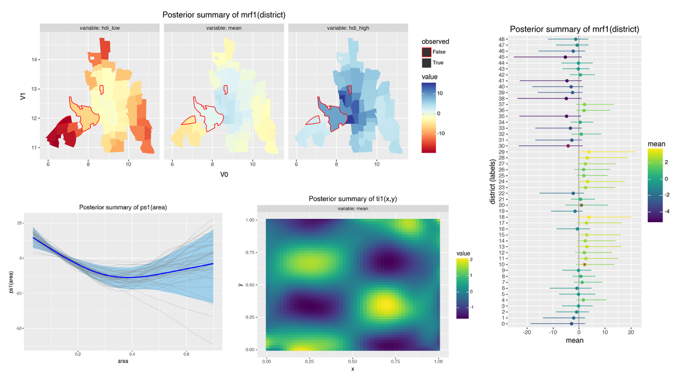

# Generalized Additive Models in Liesel

[](https://github.com/liesel-devs/liesel_gam/actions/workflows/pre-commit.yml)
[](https://github.com/liesel-devs/liesel_gam/tree/main/notebooks)
[](https://github.com/liesel-devs/liesel_gam/actions/workflows/pytest.yml)
[](https://github.com/liesel-devs/liesel_gam/actions/workflows/pytest.yml)




This library provides functionality to make the setup of
semiparametric generalized additive distributional regression models in [Liesel](https://github.com/liesel-devs/liesel)
convenient. It uses [ryp](https://github.com/Wainberg/ryp) to obtain basis and penalty
matrices from the R package [mgcv](https://cran.r-project.org/web/packages/mgcv/index.html),
and relies on [formulaic](https://github.com/matthewwardrop/formulaic) to parse
Wilkinson formulas, known to many from the formula syntax in R.

<br>

A little syntax teaser:

```python
import tensorflow_probability.substrates.jax.distributions as tfd
import liesel.model as lsl
import liesel_gam as gam

tb = gam.TermBuilder.from_df(data)             # A pandas DataFrame

loc = gam.AdditivePredictor(name="loc")

loc += tb.lin("x1 + x2*x3 + C(x4, contr.sum)") # Linear term
loc += tb.s("x5", bs="ps", k=20)               # P-spline
loc += tb.te("x6", "x7", k=(6, 8))             # Tensor product

y = lsl.Var.new_obs(
    data["y"].to_numpy(),
    distribution=lsl.Dist(tfd.Normal, loc=loc, scale=...),
    name="y"
)

model = lsl.Model([y])
```

As a Liesel addon, `liesel_gam` gives you:

- a lot of freedom to use existing building blocks to create
new models via Liesel
- just-in-time compilation for speed via [JAX](https://github.com/jax-ml/jax),
- automatic differentiation via [JAX](https://github.com/jax-ml/jax),
- access to different samplers
like Hamiltonian Monte Carlo (HMC), the No-U-turn sampler (NUTS), the
iteratively-reweighted least squares samples (IWLS), Gibbs sampling, and general
metropolis-hastings sampling via Liesel.

## Disclaimer

This library is experimental and under active development. That means:

- The API cannot be considered stable. If you depend on this library, pin the version.
- Testing has not been extensive as of now. Please check and verify!
- There is currently no documentation beyond this readme.

This library comes with no warranty or guarantees.

## Installation

You can install `liesel_gam` from pypi:

```bash
pip install liesel_gam
```

You can also install the development version from GitHub via pip:

```bash
pip install git+https://github.com/liesel-devs/liesel_gam.git
```

## Illustrations

These are pseudo-code illustrations without real data. For full examples, please
consider the [notebooks](https://github.com/liesel-devs/liesel_gam/blob/main/notebooks).

### Imports

```python
import tensorflow_probability.substrates.jax.distributions as tfd
import jax.numpy as jnp

import liesel.model as lsl
import liesel.goose as gs

import liesel_gam as gam

data = ... # assuming data is a pandas DataFrame object
```

### Additive predictors and response model

First, we set up the response model. The `gam.AdditivePredictor` classes are
containers for `lsl.Var` objects, which can added using the `+=` operator, as we will
see. By default, each `gam.AdditivePredictor` includes an intercept with a
constant prior, but you are free to pass any `lsl.Var` as the intercept
during initialization.

```python
loc_pred = gam.AdditivePredictor("mu")
scale_pred = gam.AdditivePredictor("sigma", inv_link=jnp.exp)

y = lsl.Var.new_obs(
    value=...,
    distribution=lsl.Dist(tfd.Normal, loc=loc_pred, scale=scale_pred),
    name="y"
)
```

### TermBuilder

Next, we initialize a `gam.TermBuilder`. This class helps you set up structure additive
regression terms from a dataframe.

```python
tb = gam.TermBuilder.from_df(data)
```

### TermBuilder.lin: Linear terms from formulas

Using the TermBuilder, we can now start adding terms to our predictors. For example, to
add a linear effect we can use `gam.TermBuilder.lin`, which allows us to use
Wilkinson formulas as implemented in [formulaic](https://matthewwardrop.github.io/formulaic/latest/guides/grammar/).

Note that formulaic allows you to set up several
smooth bases and these speficications are supported by `liesel_gam`. If you use
them, be aware that smooths set up via formulaic in the `lin` term will *not*  be
equipped with any regularizing priors. They will be fully unpenalized smooths. In
almost all cases, you will want to use penalized smooths. The `gam.TermBuilder` offers
dedicated methods for setting up penalized smooths, see below.

```python
loc_pred += tb.lin("x1 + x2*x3 + C(x4, contr.sum)")
scale_pred += tb.lin("x1") # using a simpler model for the scale predictor here
```

### TermBuilder.s: Penalized smooth terms

Next, we add a smooth term.

```python
loc_pred += tb.s("x5", bs="ps", k=20)
```

### MCMC algorithm setup

Finally, we build the Liesel model.

```python
model = lsl.Model([y])
```

For MCMC sampling, we then set up an engine builder. All terms returned by
`gam.TermBuilder` come with default `inference` specifications that provide a
`gs.IWLSKernel` for the coefficients of each term. Smoothing parameters receive a
default prior of `InverseGamma(scale=1.0, concentration=0.005)` and a corresponding
`gs.GibbsKernel`. This setup allows you to get first results quickly.

```python
eb = gs.LieselMCMC(model).get_engine_builder(seed=42, num_chains=4)

eb.set_duration(
    warmup_duration=1000,
    posterior_duration=1000,
    term_duration=200,
    posterior_thinning=2
)
engine = eb.build()
```

## Example notebooks

This repository includes a number of notebooks with minimal examples for using different
smooth terms. You can find them here: [Notebooks](https://github.com/liesel-devs/liesel_gam/tree/main/notebooks)

## Plotting functionality

`liesel_gam` comes with some default plotting functions building on the wonderful
[plotnine](https://plotnine.org), which brings a ggplot2-like syntax to python.

The current plotting functions are:

- `gam.plot_1d_smooth`: For plotting univariate smooths.
- `gam.plot_2d_smooth`: For plotting bivariate smooths.
- `gam.plot_regions`: For plotting discrete spatial effects like markov random fields or spatially organized random intercepts.
- `gam.plot_forest`: For plotting discrete effects like random intercepts and markov random fields.
- `gam.plot_1d_smooth_clustered`: For plotting clustered smooths, including random slopes and smooths with a random scalar.
- `gam.plot_polys`: General function for plotting discrete spatial regions.

Example usage:

```python
gam.plot_1d_smooth(
    term=model.vars["s1(x)"],  # the Term object, here retrieved from the model
    samples=samples            # the MCMC samples drawn via liesel.goose
)
```

.png)

## More information

### Customizing intercepts

By default, a `gam.AdditivePredictor` comes with an intercept that receives a constant
prior and is sampled with `gs.IWLSKernel`. You can override this default in several ways.

You can turn off the default by passing `intercept=False`:

```python
loc_pred = gam.AdditivePredictor("mu", intercept=False)
```

You can also pass a custom variable, which opens the full freedom of Liesel to you in
terms of prior and inference specification for the intercept:

```python
loc_intercept = lsl.Var.new_param(
    value=0.0,
    distribution=lsl.Dist(tfd.Normal, loc=0.0, scale=100.0),
    inference=gs.MCMCSpec(gs.NUTSKernel),
    name="mu_intercept"
)

loc_pred = gam.AdditivePredictor("mu", intercept=loc_intercept)
```

### Priors for `lin` terms

The regression coefficients of a `lin` term receive a constant prior by default.
You can customize the prior by passing a `lsl.Dist` to the `prior` argument:

```python
loc_pred += tb.lin(
    "x1 + x2*x3 + C(x4, contr.sum)",
    prior=lsl.Dist(tfd.Normal, loc=0.0, scale=100.0)
)
```

### Joint sampling for `lin` terms and intercepts

By default, each term initialized by the `gam.TermBuilder` receives their own kernel,
and this includes the intercept. That means, in the blocked MCMC algorithm employed
by Liesel, there will be one block for the intercept of each predictor and separate
blocks for other terms.

However, there may be cases in which you want intercepts and linear terms to be sampled
jointly by a single sampler. You can achieve this by customizing the `inference`
arguments and using the `gs.MCMCSpec(kernel_group)` argument:

```python
loc_intercept = lsl.Var.new_param(
    value=0.0,
    inference=gs.MCMCSpec(gs.IWLSKernel, kernel_group="loc_lin"),
    name="mu_intercept"
)

loc_pred = gam.AdditivePredictor("mu", intercept=loc_intercept)

loc_pred += tb.lin(
    "x1 + x2*x3 + C(x4, contr.sum)",
    inference=gs.MCMCSpec(gs.IWLSKernel, kernel_group="loc_lin")
)
```

### Inference for smooth coefficients

By default, the smooth coefficients receive an `gs.IWLSKernel` inference specification,
but you are free to change this:

```python
loc_pred += tb.s(
    "x5",
    bs="ps",
    k=20,
    inference=gs.MCMCSpec(gs.NUTSKernel)
)
```

### Priors and inference for variance parameters

The variance parameters in the priors of penalized smooths are controlled with the `scale` argument,
which accepts `gam.VarIGPrior` and `lsl.Var` objects, but also simple floats.

- The default `scale=gam.VarIGPrior(1.0, 0.005)` will set up an inverse gamma prior for
  the smooth's variance parameter, with parameters `concentration=1.0` and `scale=0.005`.
  The variance parameter will then automatically receive a fitting Gibbs kernel, since
  the full conditional is known in this case.
- If you pass `scale=gam.VarIGPrior(a, b)` for any `a` and `b`, you will also set up an inverse gamma prior for
  the smooth's variance parameter, with parameters `concentration=a` and `scale=b`.
  Again, the variance parameter will then automatically receive a fitting Gibbs kernel, since
  the full conditional is known in this case.
- If you pass a float, this is taken as the scale parameter and held fixed.
- You can also pass a custom `lsl.Var`. In this case, it is your responsibility to
  define a fitting `inference` specification. For example, to set up a term with a
  half-normal prior on the scale parameter, and sampling of the log scale via NUTS:

```python
scale_x5 = lsl.Var.new_param(
    1.0,
    distribution=lsl.Dist(tfd.HalfNormal, scale=20.0),
    name="scale_x5"
)

scale_x5.transform(
    bijector=tfb.Exp(),
    inference=gs.MCMCSpec(gs.NUTSKernel),
    name="log_scale_x5"
)

loc_pred += tb.s(
    "x5",
    bs="ps",
    k=20,
    scale=scale_x5
)
```

### Composing terms

Since `gam.TermBuilder` returns objects that are subclasses of `lsl.Var` objects,
you can use them as building blocks for more sophisticated models. For example,
to build a varying coefficient model, you can do the following:

```python
x1_var = tb.registry.get_obs("x1")
x2_smooth = tb.s("x2")

term = lsl.Var.new_calc(
    lambda x, by: x * by,
    x=x1_var,
    by=x2_smooth,
    name="x1*s(x2)",
)

loc_pred += term
```

In fact, this is essentially how the `gam.TermBuilder.vc` method is implemented.

### Using a custom basis function

If you have a custom basis function and a penalty matrix, you can supply them
directly to the TermBuilder.

```python
def custom_basis_fn(x: jax.Array) -> jax.Array:
    # code for your custom basis goes here

    # x is shape (n, k), where k is the number of columns in the input data that this
    # term depends on

    # the return needs to be an array of dimension (n, p)
    # where n is the number of observations for x and p is the dimension
    # of the penalty matrix corresponding to this basis.
    ...

custom_penalty = ... # your custom penalty of shape (p, p)

loc_pred += tb.f(
    # here, we supply two covariances.
    # They will be concatenated into x = jnp.stack([x6, x7], axis=-1) for passing
    # to basis_fn
    "x6", "x7",
    basis_fn=custom_basis_fn,
    penalty=custom_penalty
)
```

Implementing a custom basis via a basis function
is advantageous, because it enables us to simply pass the
covariates that this basis relies on directly to `lsl.Model.predict` for predictions:

```python
model = lsl.Model([y]) # a lsl.Model that contains an .f term

new_x6 = ... # 1d array with new data for x6
new_x7 = ... # 1d array with new data for x7
model.predict(newdata={"x6": new_x6, "x7": new_x7}, predict=["f1(x6,x7)"])
```

### Using a custom basis matrix directly

If you have a custom basis matrix and a penalty matrix, you can initialize a
`liesel_gam.Basis` object and, building on it, a `liesel_gam.Term` directly:

```python
custom_basis = gam.Basis(
    value=...,   # your basis matrix of shape (n, p) goes here
    penalty=..., # your penalty matrix of shape (p, p) goes here
    xname="x8" # the name of the basis object will by default be B(xname); here: B(x8)
)

custom_term = gam.Term.f(
    basis=custom_basis,
    scale=gam.VarIGPrior(1.0, 0.005), # also accepts any scalar-valued lsl.Var object
    fname="h" # name of the term will be fname(basis.x.name), so here: h(x8)
)

loc_pred += custom_term # still need to add the term to our predictor
```

Be aware that, if you go this route, the `lsl.Model` does *not* how to construct
your basis from input data. So to predict at new values, you will have to
provide a full basis matrix:

```python
model = lsl.Model([y]) # a lsl.Model that contains your custom term

new_custom_basis = ... # your (m, p) array, the basis matrix at which you want to predict
model.predict(newdata={"x8": new_custom_basis}, predict=["h(x8)"])
```

## Smooth terms in liesel_gam

`gam.TermBuilder` offers a range of smooth terms
as dedicated methods, including:

- `.ps`: Dedicated method for univariate P-splines
- `.s`: General method for setting up univariate smooths with an interface heavily inspired by `mgcv`. Allows for different bases specified in the argument `bs`:
  - `"tp"` (thin plate splines),
  - `"ts"` (thin plate splines with a null space penalty)
  - `"cr"` (cubic regression splines)
  - `"cs"` (cubic regression splines with shrinkage)
  - `"cc"` (cyclic cubic regression splines)
  - `"bs"` (B-splines)
  - `"ps"` (penalized B-splines, i.e. P-splines)
  - `"cp"` (cyclic P-splines)
- `.te` and `.ti`: General methods for setting up bivariate tensor product smooths,
   similar to MGCV. Quote: "te produces a full tensor product smooth, while ti produces a tensor product interaction, appropriate when the main effects (and any lower interactions) are also present."
- `.mrf`: Markov random fields (discrete-region spatial effects)
- `.ri`: Random intercept terms.
- `.rs`: Random slope terms.
- `.vc`: Varying coefficient terms

## Acknowledgements

Liesel is being developed by Paul Wiemann, Hannes Riebl, Johannes
Brachem and Gianmarco Callegher with support from Thomas Kneib. We are
grateful to the German Research Foundation (DFG) for funding the
development through grant KN 922/11-1.
